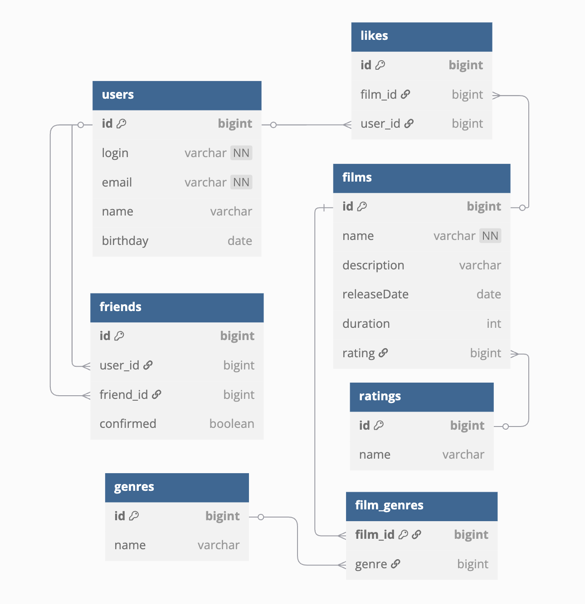

## ER-Диаграмма


## Описание таблиц:
### users
Таблица содержит информацию о пользователях:

- id: Уникальный идентификатор пользователя
- login: Логин пользователя
- email: Электронная почта пользователя
- name: Имя пользователя
- birthday: Дата рождения пользователя

### friendship
Таблица содержит информацию о списках друзей пользователей:

- id: Уникальный идентификатор записи о дружбе
- user_id: Идентификатор пользователя
- friend_id: Идентификатор друга
- confirmed: Статус заявки в друзья

### films
Таблица содержит информацию о фильмах:

- id: Уникальный идентификатор фильма
- name: Название фильма
- description: Описание фильма
- release_date: Дата выхода фильма
- duration: Продолжительность фильма
- rating: Рейтинг фильма

### genres
Таблица содержит список жанров:

- id: Уникальный идентификатор жанра
- name: Название жанра

### film_genres
Таблица содержит жанры фильмов:

- id: Уникальный идентификатор связи фильма и жанра
- film_id: Идентификатор фильма
- genre_id: Идентификатор жанра


### likes
Таблица описывает лайки, которые пользователи ставят фильмам:

- id: Уникальный идентификатор лайка
- user_id: Идентификатор пользователя
- film_id: Идентификатор фильма


### mpa_rating
Таблица описывает рейтинги, которые могут быть у фильма:

- id: Уникальный идентификатор рейтинга
- name: Идентификатор рейтинга

## Пример запроса

### Получить id и название 10 самых популярных фильмов

```sql
SELECT f.id,
       f.name,
       COUNT(l.user_id) AS likes
FROM films AS f
LEFT JOIN likes AS l ON f.id = l.film_id
GROUP BY f.id, 
         f.name
ORDER BY likes DESC
LIMIT 10;
```